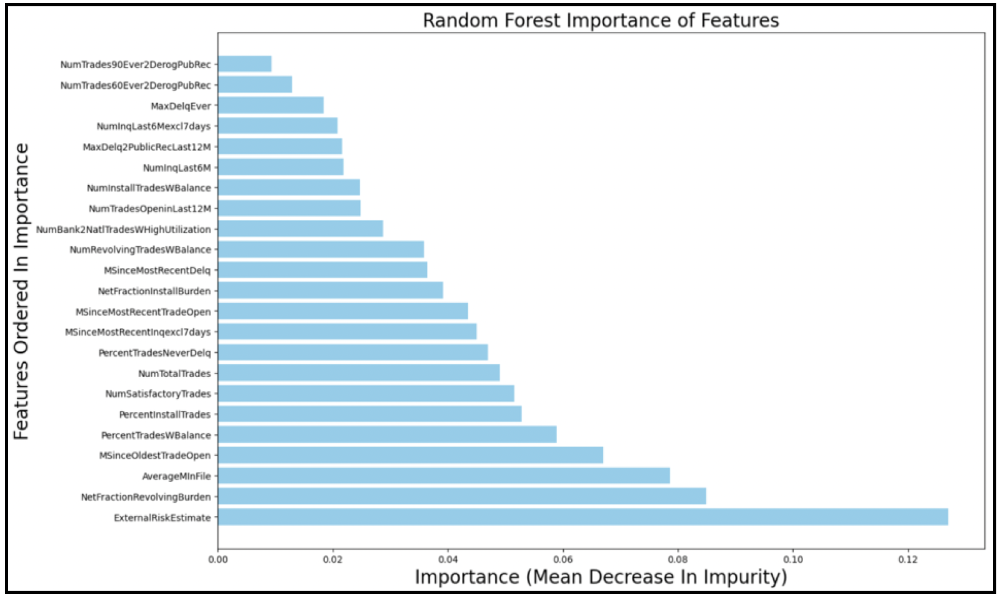
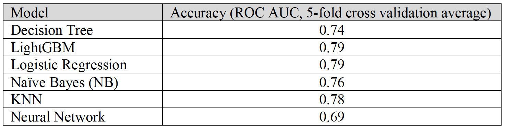
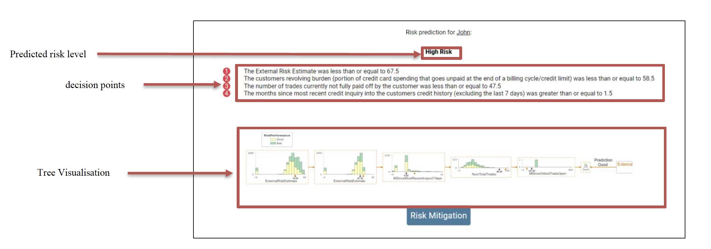
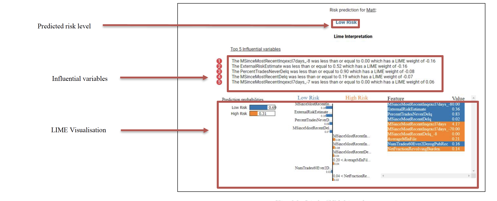
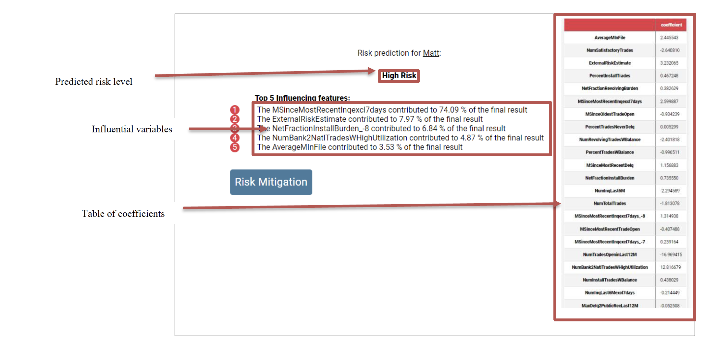

# Explainable Credit Risk Prediction

## Description 
The website aims to provide customers and small-scale lenders the ability to upload credit profiles and evaluate their credit risk by using an efficient machine learning prediction model. It will also highlight and explain the major contributing factors for the given decision, why the given decision was predicted and for the users with elevated risk ratings, various mitigation plans can be offered to reduce the risk they pose to a business.

## Data
- **Data Set**:The Data was sourced from a machine learning challenge setup by the fico community with an aim to find better explainability which will help data scientists understand their datasets and the models’ predictions of financial risk assessment better, also uncover and check for biases, and ultimately create clear models.
https://drive.google.com/drive/folders/1SCreh1F12HDJx1vuw9Xpm3QVMS_UBmzH
 
- **Data Preprocessing**: In order to clean the data several preprocessing techniques were used which included:
  -  One-hot encoding of all special values in each column
  -  Min-max scaling all numerical features to reduce the effect of noise in the dataset
  -  Removal of outliers and missing values
  -  Splitting the Dataset into Train and Test sets

- **Feature Selection**: I used Random Forest Classifier to find out the most relevant variables in comparison with target variable. Further I used these values in a grid search to determine the number of important features needed to get the best result on the test set.

## Model Selection
Three models were selected Decision Tree Classifier, LightGBM model which was implemented with the LIME model for better interpretability, Logistic Regression Model these models were selected based on the performance in terms of accuracy as well as interpretability/explainability of the model prediction.

## Risk Mitigation
In cases where high risk is predicted, the user is directed towards our risk mitigation page which displays our current three proposed risk mitigation plans that can be deployed/offered to customers with high risk to reduce the risk they pose to the business without outright denying a potential customer service.

## Output
The website was built using Python Flask and hosted with the help of Heroku
- **Decision Tree**: The decision tree model being the most straightforward in terms of explainability required a relatively simplistic output and is probably the easiest model for a broker to understand. The final output for each user inputted in the csv consists of:
1. The Predicted risk level of the user (in terms of their ability-to-repay credit): High risk or Low risk
2. A list of all the decision points considered and their outcome for the given user
3. Visualization of the overall decision pathway used to make the decision

- **LightGBM model**: Because the LightGBM model consisted of 200 weighted decision trees, using the same methods used for the decision tree model would not be feasible for an everyday user to interpret for every customer tested. To reduce this complexity and facilitate ease of use we decided to use LIME which uses linear models to approximate the local behaviour of our LightGBM model and then subsequently ranks the features based their overall contribution to the models. The final output for each user inputted in the csv consists of:
1. The Predicted risk level of the user (in terms of their ability-to-repay credit): High risk or Low risk
2. The top 5 most influential variables and their respective LIME weights
3. Visualization of the overall LIME output containing prediction probabilities, LIME weights and overall contribution of each variable

- **Logistic Regression Model**: Like the decision tree model, logistic regression is relatively straightforward in its methodology and explainability, however the model itself is likely not as intuitive as the decision tree for everyday users therefore further processing of the output needs to be performed. To generate a more palatable output, instead of just presenting the coefficients and intercept of the final model we decided to compute the contribution that each variable has on the result with respect to the other variables (not overall contribution) using the models’ coefficients, intercept, and input user values. The final output for each user inputted in the csv consists of:
1. The Predicted risk level of the user (in terms of their ability-to-repay credit): High risk or Low risk
2. The top 5 contributing features to the predicted risk level based off coefficients
3. Table of coefficients for the logistic regression model

